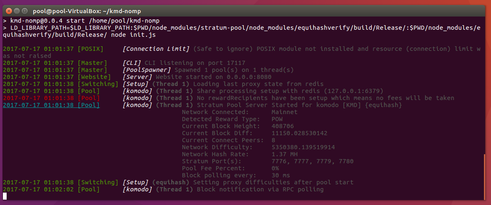

# How to setup local pool for Komodo (KMD)?

## What's this?

First of all - sorry for my english, this is not my native language. But i'm hope that everything will be clear.

In this guide we will learn how to setup Komodo (KMD) platform, how to run local wallet and how to create our own local pool for mining KMD in solo on GPU's. 

As we are know [komodo](https://github.com/jl777/komodo) software is available only for Linux now, but most users running Windows on their PC. In this case we will use [Oracle VM Virtual Box](https://www.virtualbox.org/) in this guide. It's available on Windows, OS X and Linux hosts, so, we can setup all we need in VM, independently on OS that we used on host PC.

## Installing VirtualBox and Linux

**1.** Download [VirtualBox binaries](https://www.virtualbox.org/wiki/Downloads) for your platform and install Virtual Box.
**2.** Create new VM (virtual machine) with the following options:

- OS Type: Linux
- Version: Ubuntu (64-bit)
- RAM: 4096 Mb (4 Gb seems will be enought, but better to use 8 Gb RAM in VM, it all depends on your host's RAM amount, if you have 16 Gb RAM on your host PC - choose 8192 Mb for VM, if only 8 Gb - choose 4096 Mb for VM).
- HDD: VDI (Virtual Disk Image), dynamic, 25 Gb size (25 Gb will be enough at first time, current Komodo blockchain size is near 1.7 Gb, later if 25 Gb size looks like small - you always can expand this size by using VBoxManage tool as it described here - [How to resize a Virtual Drive](https://forums.virtualbox.org/viewtopic.php?f=35&t=50661))

**3.** Download Ubuntu 16.04.2 LTS ISO Image from [official site](https://www.ubuntu.com/download/desktop) or from [one](http://mirror.yandex.ru/ubuntu-releases/)  of mirrors. I'm using that ISO - [ubuntu-16.04.2-desktop-amd64.iso](http://mirror.yandex.ru/ubuntu-releases/16.04.2/ubuntu-16.04.2-desktop-amd64.iso) (also we can use this [torrent](http://mirror.yandex.ru/ubuntu-releases/16.04.2/ubuntu-16.04.2-desktop-amd64.iso.torrent)  for download).

**4.** Install Ubuntu in VM: just put downloaded ISO in optical disk drive and run the VM, then install Ubuntu:

 

Be sure that in your VM parameters you have 25 Gb HDD size, if you miss HDD set step and leave it as default (8 Gb), installer will cause error and report that you have insufficient disk space to install.

During install i was used *pool / pool123 *as login / password, because i plan to upload this VM Image somewhere after finished this guide (look at the downloads section at the end, you can download complete VM Image and skip all setup procedures and just start using Komodo and pool). Of course using password such that is unsafe, but for local use and learning purposes - that's ok. On login and password setup screen - choose "Automatically login" options, for your convenience.

**5.** Ok, now we have installed Ubuntu x64 Desktop. If you never use Linux-based OS before - there is no problem, following this guide you can setup all needed stuff simply. But you'll need some additional knowledge. For, example, most of commands described here should be entered in Terminal (console) window, which can be easily opened by pressing *Ctrl-Alt-T* on keyboard or from Main Menu -> Search box -> Terminal application.

 

Also, in case running in Virtual Box we need to install Guest Additions for VM. How we can do this described in following manuals: [How do I install Guest Additions in a VirtualBox VM?](https://askubuntu.com/questions/22743/how-do-i-install-guest-additions-in-a-virtualbox-vm) and [Installing the Linux Guest Additions](https://www.virtualbox.org/manual/ch04.html#idm1959). When we inserted Guest Additions ISO image in virtual optical disk drive, Ubuntu's autorun automatically launch all needed and prompts to enter administrator (supervisor) password - it's *pool123* in our case.

After installing Guest Additions we need to reboot our virtual machine. Now enable common clipboard and drag&drop function in VirtualBox Devices menu to be able to copy & paste text and other data between Host OS and Guest OS.

**6.** Let's do some useful preparations: installing two file managers - MC (Midnight Commander) and Far (Far Manager for Linux), Git and some other needed stuff. Open Terminal window and type into it following commands (if system prompts you about supervisor / administrator passwords - use *pool123* password, which we entered during setup):

	sudo apt install mc
	sudo apt install git
	wget https://raw.githubusercontent.com/unxed/far2l-deb/master/far2l_64.deb
	sudo dpkg -i far2l_64.deb
	sudo apt-get -f install # to solve needed dependencies
	sudo dpkg -i far2l_64.deb # another time to install package

Now we can launch Midnight Commander and Far2l from applications menu, it can be useful in future.

## Let's setup Komodo

**1.** Open Terminal window (Ctrl-Alt-T) and successively type following:

	sudo apt install build-essential pkg-config libc6-dev libevent-dev m4 g++-multilib autoconf libtool libncurses5-dev unzip git python zlib1g-dev wget bsdmainutils automake libboost-all-dev libssl-dev libprotobuf-dev protobuf-compiler libqt4-dev libqrencode-dev libdb++-dev ntp ntpdate
	sudo apt install libcurl4-gnutls-dev 
	git clone https://github.com/jl777/komodo
	cd komodo
	./zcutil/fetch-params.sh # it's took some time and fetch some additional data
	./zcutil/build.sh -j8 # compiling all this also take some time
	
All this steps described in this [manual](https://github.com/jl777/komodo/blob/master/README.md), i'm only make small changes in building without any problems on Ubuntu 16.04.

During process you will see some magic ;) on the screen ... this is compiling process:

 
		
If it ends without errors you should see something like this in your terminal:

 	

And in ~/komodo/src directory you should see compilied binaries. To ensure that the binaries are exists and build was succefull type the following command:

	ls -l ~/komodo/src/komodod ~/komodo/src/komodo-cli
	
If you see that binaries are exists - that's Ok:

 

**2.** Now we should run komodo (Komodo Daemon) ans sync the blockchain of Komdo. But first we need to write komodo.conf file.

	mkdir -p ~/.komodo
	gedit ~/.komodo/komodo.conf
	
Add the following lines in komodo.conf and save it:

	rpcuser=bitcoinrpc
	rpcpassword=password
	txindex=1
	addnode=5.9.102.210
	addnode=78.47.196.146
	addnode=178.63.69.164
	addnode=88.198.65.74
	addnode=5.9.122.241
	addnode=144.76.94.38
	addnode=89.248.166.91	
	
After it done, run komodod:

	gnome-terminal -e "/home/pool/komodo/src/komodod"	
	
Last command will open another terminal window with running Komodo Daemon (don't close it). Now it's syncing blockchain. It tooks some time and a lot of internet trafic (at July 2017 komodo's blockchain size is near	1.7 GB). We should wait it to finish. Unfortunatelly, output of komodod is not very informative, but we can check blockchain downloading status following ways:

	~/komodo/src/komodo-cli getblockcount 
	# or
	~/komodo/src/komodo-cli getblockchaininfo | grep blocks
	
You should see current downloaded block number, to see current network block number visit [http://kmd.explorer.supernet.org/status](http://kmd.explorer.supernet.org/status)  and look in "Initial Block Chain Height" field. 

 

As we are see here our komodod succefully downloaded 46697 of 408235 blocks. It's near 11% of current blockchain. Also we can check current blockchain folder size:

	du ~/.komodo -h
	
This is output of this:

 

Here we see that the blocks folder size iz 226M, and as we know it should be near 1.7 Gb at the end of sync. So, waiting until komodod will sync it all.

Also, ht.xxxxxx strings in komodod's windows gives us information about height of current block. For example, ht.48156 string tell us that the komodod currently sync 48156 block, but for complete sync we still need wait to sync all 408235 blocks.

Unfortunatelly Komodo haven't komodo-qt GUI wallet now (like Bitcoin, for example, it have bitcoin-qt client, as we are all know). You can control your KMD wallet by using komodo-cli, but for most users this will be inconvenient. So, we need to install any GUI wallet or another tool that can control your wallet via GUI. I stopped at [Komodo Desktop GUI Wallet](https://github.com/ca333/komodoGUI) at this step. It's Java based and have "New/Experimental" status, but current release seems works fine. You can send / receive your KMD coins with this and for most people it will be enough. Let's install it ... 

	cd ~
	sudo apt-get install git default-jdk ant
	sudo apt-get install openjfx # It provides the following JAR files to the OpenJDK installation on Ubuntu systems: ant-javafx.jar, javafx-mx.jar and others
	sudo apt-get install openjfx-source # this may not be needed, but i install it
	git clone https://github.com/ca333/komodoGUI
	cd komodoGUI/
	export JAVA_HOME=/usr/lib/jvm/java-8-openjdk-amd64
	ant -buildfile ./src/build/build.xml release
	
If build was succefull you should see the following:

 	
	
Now it's time to make KomodoSwingWalletUI.jar executable (+x) attr and copy it to komodo folder:

	cd ~/komodoGUI/build/jars/
	chmod +x KomodoSwingWalletUI.jar
	cp KomodoSwingWalletUI.jar ~/komodo/src/
	cd ~/komodo/src/
	gnome-terminal -e "java -jar ./KomodoSwingWalletUI.jar"
	
Welcome to the Komodo Wallet GUI:

 	

Perfect ... Next step we will look how to setup our own local pool for KMD mining.

Also, i was added a small [autorun.sh](./autorun.sh)  script in this repo that allows you to run all needed software. Script does the following:

* Correctly stops Komodo Daemon if it's already running
* Starts komodod again
* Waiting for loading blocks
* Starts Komodo GUI Wallet 

It can be placed in Startup Applications menu in Ubuntu.

 

Remember that you **shouldn't** close komodod's terminal window by pressing "cross", instead of it, if you need to stop komodo daemon and power off the machine you should type in terminal:

	~/komodo/src/komodo-cli stop
	
And wait until komodod fineshed his work. Only after that you can power off or reboot the machine.

## Setup a local pool ...

Now it's time to setup our local pool for Komodo (KMD) using equihash algoritm. There are several ways how to do this, but we will choose most simpliest. We will use [kmd-nomp](https://github.com/xRobeSx/kmd-nomp) software from [xRobeSx](https://github.com/xRobeSx) repository. It's ready to use with small fixes and additions. Let's do it:

	cd ~
	sudo apt-get update
	sudo apt-get install build-essential pkg-config libc6-dev m4 g++-multilib autoconf libtool ncurses-dev unzip git python zlib1g-dev wget bsdmainutils automake libboost-all-dev libssl-dev libprotobuf-dev protobuf-compiler libqt4-dev libqrencode-dev libdb++-dev ntp ntpdate vim software-properties-common curl libcurl4-gnutls-dev cmake clang
	sudo apt-get install libsodium-dev npm redis-server
	sudo npm install n -g
	sudo n stable
	git clone https://github.com/xRobeSx/kmd-nomp
	cd ~/kmd-nomp/
	npm update
	npm install
	sudo service redis-server restart # restart redis server (redis is a database for your pool)
	
Now everything is almost done and we need to change some pool files and make configs.

	gedit ~/kmd-nomp/config.json
	
This will open config file named config.json for edit. Put the following lines inside and save it:

	{
	    "logLevel": "debug",
	    "logColors": true,
	
	    "cliPort": 17117,
	
	    "clustering": {
	        "enabled": false,
	        "forks": "auto"
	    },
	
	    "defaultPoolConfigs": {
	        "blockRefreshInterval": 30,
	        "jobRebroadcastTimeout": 55,
	        "connectionTimeout": 600,
	        "emitInvalidBlockHashes": false,
	        "validateWorkerUsername": true,
	        "tcpProxyProtocol": false,
	        "banning": {
	            "enabled": true,
	            "time": 600,
	            "invalidPercent": 50,
	            "checkThreshold": 500,
	            "purgeInterval": 300
	        },
	        "redis": {
	            "host": "127.0.0.1",
	            "port": 6379
	        }
	    },
	
	    "website": {
	        "enabled": true,
	        "host": "0.0.0.0",
	        "port": 8080,
	        "stratumHost": "0.0.0.0",
	        "stats": {
	            "updateInterval": 30,
	            "historicalRetention": 43200,
	            "hashrateWindow": 300
	        },
	        "adminCenter": {
	            "enabled": false,
	            "password": "password"
	        }
	    },
	
	    "redis": {
	        "host": "127.0.0.1",
	        "port": 6379
	    },
	
	    "switching": {
	        "switch1": {
	            "enabled": false,
	            "algorithm": "sha256",
	            "ports": {
	                "3333": {
	                    "diff": 10,
	                    "varDiff": {
	                        "minDiff": 16,
	                        "maxDiff": 512,
	                        "targetTime": 15,
	                        "retargetTime": 90,
	                        "variancePercent": 30
	                    }
	                }
	            }
	        },
	        "switch2": {
	            "enabled": false,
	            "algorithm": "scrypt",
	            "ports": {
	                "4444": {
	                    "diff": 10,
	                    "varDiff": {
	                        "minDiff": 16,
	                        "maxDiff": 512,
	                        "targetTime": 15,
	                        "retargetTime": 90,
	                        "variancePercent": 30
	                    }
	                }
	            }
	        },
	        "switch3": {
	            "enabled": false,
	            "algorithm": "x11",
	            "ports": {
	                "5555": {
	                    "diff": 0.001,
	                    "varDiff": {
	                        "minDiff": 0.001,
	                        "maxDiff": 1, 
	                        "targetTime": 15, 
	                        "retargetTime": 60, 
	                        "variancePercent": 30 
	                    }
	                }
	            }
	        }
	    },
	
	    "profitSwitch": {
	        "enabled": false,
	        "updateInterval": 600,
	        "depth": 0.90,
	        "usePoloniex": true,
	        "useCryptsy": true,
	        "useMintpal": true,
	        "useBittrex": true
	    }
	}

Pay attention that the **0.0.0.0** in Host and stratumHost parameters means that the pool will response on any interface, you can use your real eth interface ip here or hostname domain (if it resolves on ip).

Same way edit coin config file:

	gedit ~/kmd-nomp/coins/komodo.json
	
And put into it following:

	{
	    "name": "komodo",
	    "symbol": "kmd",
	    "algorithm": "equihash",
	    "txfee": 0.00005
	}

After edit the pool config file:

	gedit ~/kmd-nomp/pool_configs/komodo.json 

And fill it:		

	{
	    "enabled": true,
	    "coin": "komodo.json",
	
	    "address": "** FILL IT **",
	    "_comment_address": "a transparent address to send coinbase rewards to and to transfer to zAddress.",
	
	    "zAddress": "",
	    "_comment_zAddress": "shielding not required in komodo, not used",
	
	    "tAddress": "** FILL IT **",
	    "_comment_tAddress": "set to same as pools komodo address; ex, RSXGTHQSqwcMw1vowKfEE7sQ8fAmv1tmso",
	
	    "walletInterval": 5,
	    "_comment_walletInterval": "Used to cache komodo coin stats, shielding not performed.",
	
	    "rewardRecipients": {
	    },
	
	    "tlsOptions": {
	        "enabled": false,
	        "serverKey":"",
	        "serverCert":"",
	        "ca":""
	    },
	
	    "paymentProcessing": {
		"minConf": 10,
	        "enabled": false,
	        "paymentMode": "prop",
	        "_comment_paymentMode":"prop, pplnt",
	        "paymentInterval": 600,
	        "_comment_paymentInterval": "Interval in seconds to check and perform payments.",
	        "minimumPayment": 0.1,
	        "maxBlocksPerPayment": 3,
	        "daemon": {
	            "host": "127.0.0.1",
	            "port": 7771,
	            "user": "bitcoinrpc",
	            "password": "password"
	        }
	    },
	 
	"ports": {
	        "7780": {
	            "diff": 0.3,
		    "tls": false,
	            "varDiff": {
	                "minDiff": 0.2,
	                "maxDiff": 16,
	                "targetTime": 15,
	                "retargetTime": 60,
	                "variancePercent": 30
	            }
	        },
		"7777": { 
	             "tls": false,
		     "diff": 2 
	        },
		"7779": { 
	             "tls": false,
		     "diff": 3 
	        },
		"7776": { 
	             "tls": false,
		     "diff": 10 
	        }
	    },
	
	"daemons": [
	        {
	            "host": "127.0.0.1",
	            "port": 7771,
	            "user": "bitcoinrpc",
	            "password": "password"
	        }
	    ],
	
	    "p2p": {
	        "enabled": false,
	        "host": "127.0.0.1",
	        "port": 19333,
	        "disableTransactions": true
	    }
	
	
	}
	
Here pay attention that address and tAddress must be filled with existing address in your KMD wallet. To list all addresses you can use KMD GUI wallet or following command:

	~/komodo/src/komodo-cli getaddressesbyaccount ""
	
Make a patches:

	cd ~/kmd-nomp
	wget https://raw.githubusercontent.com/DeckerSU/komodo-pool-setup/master/0001-website.js-patch-to-avoid-DeprecationWarning-about-n.patch
	wget https://raw.githubusercontent.com/DeckerSU/komodo-pool-setup/master/0002-fix-block-adding-to-pending-blocks.patch
	git apply 0001-website.js-patch-to-avoid-DeprecationWarning-about-n.patch
	git apply 0002-fix-block-adding-to-pending-blocks.patch
	
Pay no attention to warnings about whitespaces. Now all is complete and we can start our pool:

		cd ~/kmd-nomp
		sudo service redis-server restart # in additional cases we need to restart redis, skip this line if all starts fine (!)
		npm start
		
Congratulatuions ;) We have setup a pool for mining Komodo. Simple, right? If i have this [great guide](https://github.com/DeckerSU/komodo-pool-setup/blob/master/README.md) at begin, it would save my time. Nowhere described some parameters from configs above, for example, if we miss "tls": false option when configure each pool port - miners will not connect to your pool. This moment was hard for me, but not for you ;)

Let's look on running pool console:

 	
	
Open new terminal (Ctrl-Alt-T) and look on ifconfig command output (i assume that in your network exists working router with DHCP server, and you setup LAN card as "Bridge" in your VirtualBox LAN settings for this VM):

 

172.17.112.32 here - is the your VM IP address. Open it in browser (add :8080 to IP in address string), and you should see the pool's web interface:

 

Now time to connect our miners ;) Setup your lucky GPU miner and start it. For Claymore's ZCash AMD GPU Miner you should use the following: 

	ZecMiner64.exe -zpool pool_host_name_or_ip:7780 -zwal "Your_KMD_Wallet" -zpsw x -allpools 1 -i 5			
	
For [ccminer-equihash](https://github.com/tpruvot/ccminer) following:

	./ccminer -a equihash -o stratum+tcp://pool_host_name_or_ip:7780 -u "Your_KMD_Wallet"
	
In pool console we will see accepted shares and their diffs:

 

17.99881044 is a founded share diff. If accepted share diff will be greater than a current block diff - you found a block (!) and get 3 KMD on your pool wallet. Current block diff showed when we start a pool. For example for block height 408706, block diff was 11150.028530142. My GTX 1060 GPU was found a share with diff 17, if diff of founded share will greater that 11150, for example i found share with diff 12000 - i will found a block.

Good luck in mining! Let the fortune smile to you!

## Downloads 

... Will be available soon ...

## Donate

* KMD: [RDecker69MM5dhDBosUXPNTzfoGqxPQqHu](http://kmd.explorer.supernet.org/address/RDecker69MM5dhDBosUXPNTzfoGqxPQqHu) 

## Credits & greetz

* [@kolo](https://sprnt.slack.com/messages/@kolo)
